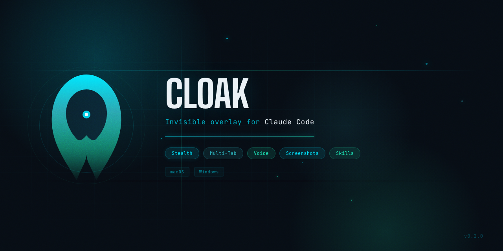

<p align="center">
  
</p>

<p align="center">
  <a href="https://github.com/pokharnajay/cloak/releases/latest"></a>
  <a href="https://github.com/pokharnajay/cloak/releases/latest"></a>
  
</p>

An invisible, floating desktop overlay for **Claude Code** and **OpenAI Codex**. Always-on-top, stealth-mode interface with multi-tab sessions, keyboard-driven permissions, screenshots, and dual AI provider support.

## Install

### macOS

**Option 1 — Homebrew** (recommended):

```bash
brew install --cask pokharnajay/cloak/app
```

**Option 2 — One-line script:**

```bash
curl -sL https://raw.githubusercontent.com/pokharnajay/cloak/main/install.sh | bash
```

**Option 3 — DMG:**

1. Download [Cloak-0.2.0-arm64.dmg](https://github.com/pokharnajay/cloak/releases/latest)
2. Open the DMG, drag **Cloak** to Applications
3. If macOS blocks it, open Terminal and run: `xattr -cr /Applications/Cloak.app`
4. Grant Accessibility & Screen Recording permissions when prompted

### Windows

Download and run the installer — adds to Start menu, Desktop, and auto-starts on boot:

| Download | Architecture |
|----------|-------------|
| [Cloak-Setup-0.2.0-x64.exe](https://github.com/pokharnajay/cloak/releases/latest) | Windows x64 |

## Features

### Core

| Feature | Claude Code | Codex |
|---------|:-----------:|:-----:|
| Multi-tab sessions | Yes | Yes |
| Live streaming output | Yes | Yes |
| Tool call visualization | Yes | Yes |
| Screenshot + Ask | Yes | Yes |
| Keyboard permission handling | Yes | Yes |
| Permission modes (Ask / Auto / Plan) | Yes | Yes |
| Stealth mode (invisible in screen shares) | Yes | Yes |
| Dark / Light theme | Yes | Yes |
| Always on top (all workspaces) | Yes | Yes |
| Auto-start on boot | Yes | Yes |

### Claude Code Exclusive

| Feature | Details |
|---------|---------|
| Model switching | Opus 4.6, Sonnet 4.6, Haiku 4.5 |
| File attachments | Drag & drop, file picker, clipboard paste |
| Session history | Browse and resume past conversations |
| Multi-turn sessions | Built-in via `claude -p --session-id` |
| Skills marketplace | Install community skills and plugins |
| Image attachments | Inline base64 in conversation |

### OpenAI Codex Exclusive

| Feature | Details |
|---------|---------|
| Model selection | Uses `~/.codex/config.toml` default |
| Multi-turn conversations | Via `codex exec resume <thread_id>` |
| Image attachments | Via `-i <filepath>` flag (screenshots) |
| Sandbox modes | `--full-auto`, `--sandbox read-only`, `--sandbox workspace-write` |

### Stealth Mode

When stealth is ON, Cloak is completely invisible during screen sharing:

- Content protection enabled (OS-level screen capture blocking)
- No tray icon or dock icon
- File picker dialogs blocked (would appear in recordings)
- No system notifications
- No app switcher visibility

## Keyboard Shortcuts

| Action | macOS | Windows |
|--------|-------|---------|
| Toggle overlay | Option + Space | Ctrl + Space |
| Screenshot + Ask | Option + Shift + S | Ctrl + Shift + S |
| Approve permission | Enter | Enter |
| Deny permission | Esc | Esc |
| Select option | 1-9 | 1-9 |

## Prerequisites

You need at least one CLI installed:

| Provider | Install | Auth |
|----------|---------|------|
| Claude Code | `npm i -g @anthropic-ai/claude-code` | `claude` (follow prompts) |
| Codex | `npm i -g @openai/codex` | `codex` (follow prompts or set `OPENAI_API_KEY`) |

## Settings

| Setting | Default | Description |
|---------|---------|-------------|
| Full width | Off | Expand overlay to full width |
| AI Provider | Claude | Switch between Claude Code and Codex |
| Stealth mode | On | Invisible in screen shares |
| Dark theme | On | Toggle dark/light mode |

Switch providers from Settings (three-dot menu) — conversations are isolated per provider and restored when switching back.

## Build from Source

<details>
<summary>macOS</summary>

```bash
xcode-select --install
git clone https://github.com/pokharnajay/cloak.git
cd cloak
npm install
npm run dist:dmg
```

</details>

<details>
<summary>Windows</summary>

```powershell
git clone https://github.com/pokharnajay/cloak.git
cd cloak
npm install
npm run dist:win
```

</details>

## Troubleshooting

| Problem | Fix |
|---------|-----|
| "Move to Trash" on first open | Use Homebrew or curl installer. Or run: `xattr -cr /Applications/Cloak.app` |
| App won't open (macOS) | System Settings > Privacy & Security > Open Anyway |
| `claude` not found | `npm i -g @anthropic-ai/claude-code` |
| `codex` not found | `npm i -g @openai/codex` |
| Screenshots black/empty | Grant Screen Recording permission |
| Shortcut not registering | May conflict with another app — close conflicting apps |
| Codex "Not inside a trusted directory" | Handled automatically via `--skip-git-repo-check` |

## Tech Stack

| Component | Version |
|-----------|---------|
| Electron | 35.x |
| React | 19.x |
| Framer Motion | 12.x |
| Zustand | 5.x |

## License

[MIT](LICENSE)
